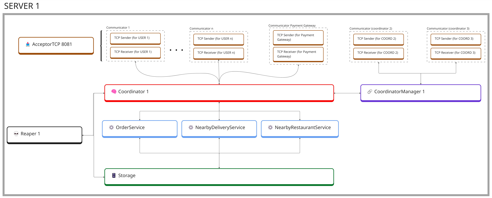

<p align="center">
  
</p>

# Programacion Concurrente - 2C2025 - PedidosRust

[](https://classroom.github.com/a/YmMajyCa)

**PedidosRust** es un sistema distribuido implementado en Rust que modela la interacción entre *clientes*, *restaurantes*, *repartidores* y un *gateway de pagos*. Cada entidad funciona como una aplicación independiente, comunicándose mediante mensajes TCP.

La consigna del trabajo práctico puede encontrarse [aqui](https://concurrentes-fiuba.github.io/2025_1C_tp2.html) 

---

## Autores

| Nombre          | Apellido      | Mail                  | Padrón |
| --------------- | ------------- | --------------------- | ------ |
| Ian             | von der Heyde | ivon@fi.uba.ar        | 107638 |
| Agustín         | Altamirano    | aaltamirano@fi.uba.ar | 110237 |
| Juan Martín     | de la Cruz    | jdelacruz@fi.uba.ar   | 109588 |
| Santiago Tomás  | Fassio        | sfassio@fi.uba.ar     | 109463 |

---

## Índice

1. [Descripción general del sistema](#descripción-general-del-sistema)
   * [Características principales](#características-principales)
   * [Procesos del sistema](#procesos-del-sistema)
   * [Actores por cada proceso](#actores-por-proceso)
   * [Descripción de los mensajes](#descripción-de-los-mensajes)
6. [Instalación y Ejecución](#instalación-y-ejecución)
7. [Ejemplo de Ejecución](#ejemplo-de-ejecución)
8. [Pruebas](#pruebas)

---

## **Descripción general del sistema**

### **Características principales**

* **Modelo de Actores Asincrónicos**
  El sistema está construido siguiendo el **modelo de actores**, lo que permite una gestión eficiente y concurrente de mensajes entre múltiples entidades distribuidas. Cada componente del sistema (clientes, restaurantes, repartidores, servidores) está representado por actores independientes que se comunican de forma no bloqueante a través de TCP.

* **Coordinación distribuida y elección de coordinador**
  Se implementa el **algoritmo del anillo (Ring Algorithm)** para llevar a cabo la **elección de un Coordinator Manager** entre los distintos procesos `Coordinator`. Este mecanismo garantiza que, ante la caída del coordinador actual, el sistema pueda elegir automáticamente un nuevo líder sin necesidad de intervención externa.

* **Exclusión Mutua Distribuida (Centralizada)**
  Para operaciones críticas que requieren acceso exclusivo a ciertos recursos (por ejemplo, actualización de datos globales), se utiliza un enfoque de **exclusión mutua distribuida centralizada**. El coordinador electo es el encargado de otorgar el permiso de acceso, garantizando consistencia y evitando condiciones de carrera entre los nodos.

* **Resiliencia y Tolerancia a Fallos**
  El sistema está diseñado con foco en la **tolerancia a fallos**, permitiendo que nodos individuales (como clientes, repartidores o restaurantes) puedan desconectarse temporalmente **sin afectar el flujo global del sistema**. Esta resiliencia se logra mediante:

  * **Heartbeats periódicos** entre procesos `Coordinator`, para detectar y responder rápidamente ante fallas.
  * **Backups sincronizados** del estado del sistema, asegurando persistencia y recuperación consistente.
  * **Soporte para reconexión de nodos**: los procesos pueden reconectarse automáticamente. Además, según el **estado actual de la orden**, es posible que ciertas operaciones (como la entrega de un pedido) continúen exitosamente **incluso si un cliente u otro nodo se encuentra momentáneamente desconectado**.

---

### **Procesos del Sistema**

El sistema está conformado por múltiples procesos independientes que se ejecutan en consolas separadas. Cada proceso representa un **nodo autónomo** dentro de la arquitectura distribuida del sistema, y se comunica mediante **mensajes TCP asincrónicos**.

#### Procesos principales

Los siguientes procesos representan las distintas funciones centrales del sistema:

* **PaymentGateway** — Puerto TCP: `8080`
* **Server1** — Puerto TCP: `8081`
* **Server2** — Puerto TCP: `8082`
* **Server3** — Puerto TCP: `8083`
* **Server4** — Puerto TCP: `8084`

Cada uno de estos servidores ejecuta un `Coordinator`, coordina actores internos y maneja conexiones con otros nodos del sistema.

#### Procesos dinámicos

Además, por cada entidad de negocio se lanza un proceso independiente:

* **Cliente** — Un proceso por cada cliente activo.
* **Restaurante** — Un proceso por cada restaurante disponible.
* **Delivery** — Un proceso por cada repartidor conectado.

Estos procesos se conectan dinámicamente a alguno de los `Server`, y se comunican de forma bidireccional para operar dentro del sistema (por ejemplo, iniciar pedidos, aceptar entregas, recibir actualizaciones, etc.).

---

### Actores por proceso

Cada proceso está compuesto por varios actores, cada uno con una responsabilidad específica. A continuación se describen los actores de cada proceso:

* [**Proceso Server**](#proceso-server): 
  * Acceptor
  * N Communicators -> (TCPSender, TCPReceiver)
  * Coordinator
  * CoordinatorManager
  * OrderService
  * NearbyDeliveryService
  * NearbyRestaurantService
  * Storage
  * Reaper

* [**Proceso PaymentGateway**](#proceso-paymentgateway):
  * Acceptor
  * PaymentGateway
  * N Communicators -> (TCPSender, TCPReceiver)

* [**Proceso Cliente**](#proceso-cliente):
  * Client
  * UIHandler
  * Communicator -> (TCPSender, TCPReceiver)

* [**Proceso Restaurante**](#proceso-restaurante):
  * Restaurant
  * Kitchen
  * Chef
  * DeliveryAssigner
  * Communicator -> (TCPSender, TCPReceiver)

* [**Proceso Delivery**](#proceso-delivery):
  * TCP Sender
  * TCP Receiver
  * Delivery
  * Communicator -> (TCPSender, TCPReceiver)

---

### Comunicación entre procesos: `TCP Sender` y `TCP Receiver`

La comunicación entre procesos distribuidos en este sistema se realiza a través de **mensajes TCP**. Para abstraer esta comunicación y mantener la lógica del sistema desacoplada del transporte subyacente, se utilizan dos actores especializados:

#### 📤 `TCPSender` *(Async)*

El `TCPSender` es el actor responsable de **enviar mensajes TCP** hacia otro nodo del sistema.

```rust
pub struct TCPSender {
    pub writer: Option<BufWriter<WriteHalf<TcpStream>>>,
}
```

Características:

* Utiliza un `BufWriter` sobre la mitad de escritura del socket (`WriteHalf<TcpStream>`).
* Recibe mensajes desde otros actores del sistema (por ejemplo, `Coordinator`, `Client`, etc.) y los escribe en el socket.
* Está diseñado para trabajar en paralelo con un `TCPReceiver` que lee de la misma conexión.

#### 📥 `TCPReceiver` *(Async)*

El `TCPReceiver` es el actor responsable de **leer mensajes entrantes desde un socket TCP** y reenviarlos al actor de destino adecuado dentro del sistema.

```rust
pub struct TCPReceiver {
    reader: Option<BufReader<ReadHalf<TcpStream>>>,
    destination: Addr<Actor>,
}
```

Características:

* Utiliza un `BufReader` sobre la mitad de lectura del socket (`ReadHalf<TcpStream>`).
* Deserializa cada línea recibida y la envía como mensaje al actor indicado mediante `destination`.
* Es genérico en cuanto al actor destino, lo que permite reutilizarlo en múltiples procesos (por ejemplo, `Client`, `Restaurant`, etc.).

#### 🔄 Emparejamiento mediante `Communicator`

Tanto el `TCP Sender` como el `TCP Receiver` están encapsulados dentro de una estructura llamada `Communicator`, que representa una **conexión lógica con otro nodo** (cliente, restaurante, delivery, otro servidor, o el Payment Gateway).

```rust
pub struct Communicator {
    pub sender: Addr<TCPSender>,
    pub receiver: Addr<TCPReceiver>,
    pub peer_type: PeerType, // Enum: Client, Restaurant, Delivery, Coordinator, Gateway
}
```

Este diseño permite que los distintos actores del sistema interactúen entre sí mediante mensajes, sin necesidad de preocuparse por la gestión directa de sockets o serialización.

---

### **Proceso `Server`**

Cada proceso `Server` representa un nodo del sistema. Cada uno de estos procesos se ejecuta en una consola diferente y se comunica a través de mensajes TCP.

A continuación, desarrollaremos en base al proceso `Server1` como ejemplo, pero el funcionamiento es el mismo para los otros procesos `Server`.


<p align="center">
  

</p>


---

#### 🔌 **Acceptor** *(Async)*

El actor **Acceptor** es responsable de escuchar el puerto TCP del proceso `Server`, aceptando conexiones entrantes desde diversos tipos de nodos del sistema: clientes, restaurantes, repartidores, otros servidores (`CoordinatorX`) y el `Payment Gateway`.

Por cada nueva conexión aceptada, se instancian automáticamente los siguientes actores de comunicación:

* 📤 [`TCPSender`](#comunicación-entre-procesos-tcp-sender-y-tcp-receiver)
* 📥 [`TCPReceiver`](#comunicación-entre-procesos-tcp-sender-y-tcp-receiver)

Estos actores son los encargados de gestionar la entrada y salida de mensajes TCP entre el `Server` y el nodo conectado, desacoplando así la lógica de transporte del resto del sistema.

##### Estado interno del actor Acceptor

```rust
pub struct Acceptor {
    /// Puerto TCP donde escucha nuevas conexiones.
    pub listen_port: u16,
    /// Lista de conexiones activas.
    pub active_connections: HashSet<SocketAddr>,
}
```

---

#### 🧠 **Coordinator** *(Async)*

El actor **Coordinator** es el **componente central de coordinación** del proceso `Server`. Su función principal es recibir, interpretar y direccionar todos los mensajes entrantes del sistema.

Responsabilidades:

* Recibir mensajes provenientes de los `TCPReceiver`.
* Enviar mensajes hacia los `TCPSender` asociados a clientes, restaurantes, repartidores y al `Payment Gateway`.
* Coordinar acciones con los actores internos:

  * [`CoordinatorManager`](#🔗-coordinatormanager-async)
  * [`OrderService`](#️⚙️-servicios-internos-async)
  * [`NearbyDeliveryService`](#️⚙️-servicios-internos-async)
  * [`NearbyRestaurantService`](#️⚙️-servicios-internos-async)
  * [`Storage`](#🗄️-storage-async)
  * [`Reaper`](#💀-reaper-async)

##### Estado interno del actor Coordinator

```rust
pub struct Coordinator {
  /// Coordinador actual.
  pub current_coordinator: Option<SocketAddr>,
  /// Estado de los pedidos en curso.
  pub active_orders: HashSet<u64>,
  /// Diccionario de conexiones activas con clientes, restaurantes, deliverys y gateways.
  pub communicators: HashMap<SocketAddr, Communicator>,
  /// Canal de envío hacia el actor `Storage`. 
  pub storage: Addr<Storage>,
  /// Canal de envío hacia el actor `Reaper`.
  pub reaper: Addr<Reaper>,
  /// Servicio de órdenes.
  pub order_service: Addr<OrderService>,
  /// Servicio de restaurantes cercanos.
  pub nearby_restaurant_service: Addr<NearbyRestaurantService>,
  /// Servicio de deliverys cercanos.
  pub nearby_delivery_service: Addr<NearbyDeliveryService>,
}
```

---

#### 🔗 **CoordinatorManager** *(Async)*

El actor **CoordinatorManager** es el encargado de la **coordinación distribuida entre instancias del proceso `Server`** (Coordinators).

Este actor utiliza los `Communicator` previamente establecidos con `Coordinator2`, `Coordinator3` y `Coordinator4` para implementar:

* El algoritmo de **anillo (ring)** para la organización lógica de los servidores y elección de líder.
* Envío de **heartbeats** para detectar fallos.
* Sincronización periódica del estado del sistema (`Storage`) entre nodos.

##### Estado interno del actor CoordinatorManager

```rust
pub struct CoordinatorManager {
    /// Lista ordenada de nodos en el anillo.
    pub ring_nodes: Vec<SocketAddr>,
    /// Nodo coordinador actual.
    pub coordinator: Option<SocketAddr>,
    /// Timestamps de los últimos heartbeats recibidos por nodo.
    pub heartbeat_timestamps: HashMap<SocketAddr, Instant>,
}
```

---

#### ⚙️ **Servicios internos** *(Async)*

Los servicios internos se encargan de tareas especializadas dentro del proceso `Server`, accediendo al actor `Storage` para realizar lecturas y actualizaciones consistentes.

* **OrderService**
  Mantiene el estado de las órdenes en curso.
  Se comunica con: `Coordinato`, `Storage`.

* **NearbyRestaurantService**
  Identifica restaurantes cercanos a un cliente para iniciar el proceso de pedido.
  Se comunica con: `Coordinator`, `Storage`.

* **NearbyDeliveryService**
  Encuentra repartidores disponibles próximos a un restaurante para asignar la entrega.
  Se comunica con: `Coordinator`, `Storage`.

##### Estado interno de OrderService

```rust
pub struct OrderService {
   /// Diccionario local de órdenes y sus estados.
   pub orders: HashMap<u64, OrderStatus>,
   /// Diccionario local de clientes y su órden.
   pub clients_orders: HashMap<String, Vec<u64>>,
   /// Diccionario local de restaurantes y sus órdenes.
   pub restaurants_orders: HashMap<String, Vec<u64>>,
   /// Cola de órdenes pendientes para procesamiento.
   pub pending_orders: Vec<u64>,
}
```

##### Estado interno de NearbyDeliveryService

```rust
pub struct NearbyDeliveryService {
   /// Cache local de repartidores disponibles con su ubicación.
   pub available_deliveries: HashMap<String, (f32, f32)>, // delivery_id -> posición (latitud, longitud)
}
```

##### Estado interno de NearbyRestaurantService

```rust
pub struct NearbyRestaurantService {
   /// Cache local de restaurantes disponibles con su ubicación.
   pub available_restaurants: HashMap<String, (f32, f32)>, // restaurant_id -> posición (latitud, longitud)
}
```

---

#### 🗄️ **Storage** *(Async)*

El actor **Storage** es responsable de la **persistencia del estado global** del sistema. Administra en memoria la información de entidades del sistema y permite acceder a ellas de forma segura y eficiente.

Gestiona:

* Información de clientes, restaurantes y repartidores.
* Estado detallado de cada orden.

Se comunica directamente con los siguientes actores:

* `Coordinator`
* `OrderService`
* `NearbyDeliveryService`
* `NearbyRestaurantService`

##### Estado interno del storage actor

```rust
pub struct ClientDTO {
  /// Posición actual del cliente en coordenadas 2D.
  pub client_position: (f32, f32),
  /// ID único del cliente.
  pub client_id: String,
  /// Pedido del cliente (id de alimento).
  pub client_order_id: Option<u64>,
  /// Marca de tiempo que registra la última actualización del cliente.
  pub time_stamp: Instant,
}

pub struct RestaurantDTO {
  /// Posición actual del restaurante en coordenadas 2D.
  pub restaurant_position: (f32, f32),
  /// ID único del restaurante.
  pub restaurant_id: String,
  /// Pedidos autorizados por el PaymentGatewat pero no aceptados todavía
  /// por el restaurante
  pub authorized_orders: Vec<OrderDTO>,
  /// Pedidos pendientes.
  pub pending_orders: Vec<OrderDTO>,
  /// Marca de tiempo que registra la última actualización del restaurante.
  pub time_stamp: Instant,
}

pub struct DeliveryDTO {
  /// Posición actual del delivery en coordenadas 2D.
  pub delivery_position: (f32, f32),
  /// ID único del delivery.
  pub delivery_id: String,
  /// ID del cliente actual asociado con el delivery (si existe).
  pub current_client_id: Option<String>,
  /// ID de la orden actual.
  pub current_order_id: Option<u64>,
  /// Estado actual del delivery.
  pub status: DeliveryStatus,
  /// Marca de tiempo que registra la última actualización del delivery.
  pub time_stamp: Instant,
}

pub struct OrderDTO {
  /// ID de la orden.
  pub order_id: u64,
  /// ID del cliente asociado a la orden.
  pub client_id: String,
  /// ID del restaurante asociado a la orden.
  pub restaurant_id: String,
  /// ID del delivery asociado a la orden.
  pub delivery_id: Option<String>,
  /// Estado de la orden.
  pub status: OrderStatus,
  /// Marca de tiempo que registra la última actualización de la orden.
  pub time_stamp: Instant,
}

pub struct Storage {
  /// Diccionario con información sobre clientes.
  pub clients: HashMap<String, ClientEntity>,
  /// Diccionario con información sobre restaurantes.
  pub restaurants: HashMap<String, RestaurantEntity>,
  /// Diccionario con información sobre deliverys.
  pub deliverys: HashMap<String, DeliveryEntity>,
  /// Diccionario de órdenes.
  pub orders: HashMap<u64, OrderEntity>,
  /// Lista de operaciones recibidas.
  pub operations: Vec<Message>

}
```

---

#### 💀 **Reaper** *(Async)*

El actor **Reaper** escucha mensajes del `Coordinator` sobre desconexiones, y espera un tiempo antes de eliminar definitivamente a un usuario desconectado que no se reconectó todavía.

Responsabilidades:

1. Recibir mensajes `ReapUser` desde el `Coordinator` con información del usuario desconectado.
2. Iniciar un temporizador de ciertos segundos por cada entidad.
3. Al finalizar el temporizador, reenviar el mismo mensaje `ReapUser` al `Storage` para que decida si debe eliminarlo (basado en su timestamp más reciente).

##### Estado interno de `Reaper`

```rust
pub struct Reaper {
  /// Referencia al actor `Storage`.
  pub storage: Addr<Storage>,
}
```

### Tabla de estados del usuario (desde la perspectiva del Reaper)

| Estado Inicial      | Evento o Acción                       | Estado Final        | Actor Responsable      | Comentario                                                      |
| ------------------- | ------------------------------------- | ------------------- | ---------------------- | --------------------------------------------------------------- |
| `CONECTADO`         | Socket se cierra                      | `PENDIENTE_DE_REAP` | `Coordinator → Reaper` | El coordinator detecta desconexión y lo reporta al Reaper.      |
| `PENDIENTE_DE_REAP` | Usuario no se reconecta en 10s        | `ELIMINADO`         | `Reaper → Storage`     | Se verifica si hubo reconexión; si no, se elimina la entidad.   |
| `PENDIENTE_DE_REAP` | Usuario se reconecta antes de los 10s | `RECUPERADO`        | `Storage`              | El Storage detecta un timestamp más reciente y no elimina nada. |


---

### Mensajes del Proceso `Server`

#### **Liderazgo y Coordinación**

| Mensaje        | Emisor                         | Receptor                       | Descripción                                                                                                                 |
| -------------- | ------------------------------ | ------------------------------ | --------------------------------------------------------------------------------------------------------------------------- |
| WhoIsLeader    | CoordinatorManagerX            | CoordinatorManagerY            | Pregunta quién es el líder actual. Si no hay respuesta, asigna a su coordinador como líder enviando el mensaje `IAmLeader`. |
| IAmLeader      | CoordinatorManagerX            | Todos los CoordinatorManagers  | Informa que el Coordinador asociado ha sido elegido líder.                                                                  |
| WhoIsLeader    | Client / Restaurant / Delivery | Todos los Coordinators         | Pregunta quién es el líder actual. Le responde quien es.                                                                    |
| LeaderIs       | Todos los Coordinators         | Client / Restaurant / Delivery | Informa quién es el líder actual.                                                                                           |
| StartElections | CoordinatorManagerX            | CoordinatorManagerY            | Envía el mensaje de elecciones con su ID al siguiente coordinador.                                                          |

---

#### **Sincronización y replicación entre coordinadores**

| Mensaje                  | Emisor              | Receptor            | Descripción                                                                                                                 |
| ------------------------ | ------------------- | ------------------- | --------------------------------------------------------------------------------------------------------------------------- |
| RequestNewMessages(u64)  | CoordinatorManagerX | CoordinatorManagerY | Pide actualizaciones (mensajes que aún no le llegaron a él). Corre internamente solo los que generan cambios en el storage. |
| GetOperations(u64)       | CoordinatorManagerY | Storage             | Solicita las operaciones desde cierto ID.                                                                                   |
| Operations(Vec<Message>) | Storage             | CoordinatorManagerY | Devuelve las operaciones requeridas.                                                                                        |
| Messages()               | CoordinatorManagerY | CoordinatorManagerX | Envía los mensajes a sincronizar.                                                                                           |
| RunMessages              | CoordinatorManagerX | CoordinatorX        | Ejecuta localmente los mensajes recibidos.                                                                                  |

---

#### **Reap y desconexiones**

| Mensaje                     | Emisor      | Receptor | Descripción                                                               |
| --------------------------- | ----------- | -------- | ------------------------------------------------------------------------- |
| StartReapProcess(<UserDTO>) | Coordinator | Reaper   | Notifica que un socket se cerró, posiblemente indicando desconexión.      |
| CheckReapUser               | Reaper      | Storage  | En caso de que la última conexión sea mayor a X tiempo, borra el usuario. |

---

#### **Recepción y envío TCP**

| Mensaje                   | Emisor                           | Receptor                         | Descripción                                                                |
| ------------------------- | -------------------------------- | -------------------------------- | -------------------------------------------------------------------------- |
| ForwardMessage(<Message>) | TCPReceiver                      | Coordinator / CoordinatorManager | Encapsula cualquier mensaje externo recibido por TCP hacia el coordinador. |
| SendToSocket(<Message>)   | Coordinator / CoordinatorManager | TCPSender                        | Solicita enviar un mensaje a través del socket asociado.                   |

---

#### **Ubicación y servicios cercanos**

| Mensaje                                  | Emisor                  | Receptor                | Descripción                                         |
| ---------------------------------------- | ----------------------- | ----------------------- | --------------------------------------------------- |
| RequestNearbyRestaurants(<ClientDTO>)    | Client                  | Coordinator             | El cliente solicita los restaurantes cercanos.      |
| RequestNearbyRestaurants(<ClientDTO>)    | Coordinator             | NearbyRestaurantService | Solicita lista de restaurantes cercanos al cliente. |
| NearbyRestaurants(Vec<RestaurantsDTO>)   | NearbyRestaurantService | Coordinator             | Devuelve restaurantes cercanos.                     |
| RequestNearbyDeliveries(<RestaurantDTO>) | Coordinator             | NearbyDeliveryService   | Solicita lista de repartidores disponibles.         |
| NearbyDeliveries(Vec<DeliverysDTO>)      | NearbyDeliveryService   | Coordinator             | Devuelve repartidores disponibles.                  |
| GetDeliveries()                          | NearbyDeliveryService   | Storage                 | Solicita los repartidores registrados.              |
| Deliveries(<DeliveriesDTO>)              | Storage                 | NearbyDeliveryService   | Devuelve los repartidores almacenados.              |
| GetRestaurants()                         | NearbyRestaurantService | Storage                 | Solicita los restaurantes registrados.              |
| Restaurants(<DeliveriesDTO>)             | Storage                 | NearbyRestaurantService | Devuelve los restaurantes almacenados.              |

---

#### **Pagos y autorización**

| Mensaje                          | Emisor         | Receptor       | Descripción                              |
| -------------------------------- | -------------- | -------------- | ---------------------------------------- |
| RequestAuthorization(<OrderDTO>) | Coordinator    | PaymentGateway | Solicita autorización del pago.          |
| RequestChargeOrder(<OrderDTO>)   | Coordinator    | PaymentGateway | Solicita ejecución del cobro.            |
| AuthorizedOrder(<OrderDTO>)      | PaymentGateway | Coordinator    | Respuesta positiva a la autorización.    |
| DeniedOrder(<OrderDTO>)          | PaymentGateway | Coordinator    | El pago fue denegado.                    |
| SendMoney(<OrderDTO>)            | PaymentGateway | Coordinator    | Confirmación de transferencia de fondos. |

---

#### **Registro y recuperación de usuario**

| Mensaje                            | Emisor      | Receptor                       | Descripción                                           |
| ---------------------------------- | ----------- | ------------------------------ | ----------------------------------------------------- |
| RegisterUser(<UserDTO>)            | TCPReceiver | Coordinator                    | Un usuario nuevo se conecta.                          |
| RequestUserInfo(<UserDTO>)         | Coordinator | Storage                        | Le pregunta al Storage si hay un determinado usuario. |
| RecoveredUserInfo(Option<UserDTO>) | Storage     | Coordinator                    | Devuelve info del usuario si existe.                  |
| RecoveredUserInfo(Option<UserDTO>) | Coordinator | Client / Restaurant / Delivery | Devuelve info del usuario si existe o `None`.         |

---

#### **Pedidos**

| Mensaje                           | Emisor              | Receptor    | Descripción                                     |
| --------------------------------- | ------------------- | ----------- | ----------------------------------------------- |
| RequestThisOrder(<OrderDTO>)      | Client              | Coordinator | Cliente envía un nuevo pedido.                  |
| NewOrder(<OrderDTO>)              | Coordinator         | Restaurant  | El coordinador envía el pedido al restaurante.  |
| CancelOrder(<OrderDTO>)           | Restaurant          | Coordinator | El restaurante cancela el pedido.               |
| UpdateOrderStatus(<OrderDTO>)     | Restaurant/Delivery | Coordinator | Informa cambio de estado del pedido.            |
| OrderFinalized(<OrderDTO>)        | Client              | Coordinator | El cliente indica que el pedido fue finalizado. |
| NotifyOrderUpdated(<OrderDTO>)    | Coordinator         | Client      | Notifica al cliente un cambio de estado.        |
| AuthorizationResult(Result)       | Coordinator         | Client      | Resultado de la autorización.                   |
| RequestNearbyDelivery(<OrderDTO>) | Restaurant          | Coordinator | El restaurante solicita delivery.               |
| DeliveryAvailable(<OrderDTO>)     | Coordinator         | Restaurant  | Se encontró delivery disponible.                |
| DeliverThisOrder(<OrderDTO>)      | Restaurant          | Coordinator | Solicita enviar pedido a delivery.              |
| IAmAvailable(<DeliveryDTO>)       | Delivery            | Coordinator | El delivery indica disponibilidad.              |
| DeliverThisOrder(<OrderDTO>)      | Coordinator         | Delivery    | Asigna pedido al delivery.                      |
| DeliveryNoNeeded(<OrderDTO>)      | Coordinator         | Delivery    | Informa que el delivery no es necesario.        |
| Delivered(<OrderDTO>)             | Delivery            | Coordinator | Pedido entregado.                               |

---

#### **Persistencia**

| Mensaje                 | Emisor       | Receptor     | Descripción                          |
| ----------------------- | ------------ | ------------ | ------------------------------------ |
| UpdateOrder(<OrderDTO>) | Coordinator  | OrderService | Actualiza estado del pedido.         |
| UpdateOrder(<OrderDTO>) | OrderService | Storage      | Persiste el nuevo estado del pedido. |


---

### **Proceso `PaymentGateway`**

El proceso `PaymentGateway` simula un gateway de pagos que autoriza y cobra órdenes de pedido. Se ejecuta como un servicio independiente, escuchando conexiones de procesos `Coordinator`, y responde a solicitudes de autorización o cobro. Es responsable de validar pedidos y decidir si se aprueban, así como de efectuar el cobro de órdenes previamente autorizadas.

El proceso está compuesto por dos actores principales:

* [`Acceptor`](#paymentgateway-async)
* [`PaymentGateway`](#paymentgateway-async)

Además, contiene un [`Communicator`](#communicator-async) al igual que otros procesos.

---

### Tabla de estados del pedido (desde la perspectiva del PaymentGateway)

| Estado Inicial     | Evento o Acción              | Estado Final | Actor Responsable | Comentario                                                 |
| ------------------ | ---------------------------- | ------------ | ----------------- | ---------------------------------------------------------- |
| `NO_RECORD`        | Llega `RequestAuthorization` | `AUTHORIZED` | `Communicator`    | Se autoriza la orden y se guarda en memoria.               |
| `NO_RECORD`        | Llega `RequestAuthorization` | `DENIED`     | `Communicator`    | Se rechaza la orden (probabilidad).                        |
| `AUTHORIZED`       | Llega `RequestChargeOrder`   | `CHARGED`    | `Communicator`    | Se efectúa el cobro de la orden previamente autorizada.    |
| `DENIED` o ausente | Llega `RequestChargeOrder`   | (Sin cambio) | `Communicator`    | La orden no existe o fue denegada, no se realiza el cobro. |

---

#### 💵 **PaymentGateway** *(Async)*

El actor **PaymentGateway** representa el servidor principal que escucha conexiones en el puerto 8080. Su función es aceptar conexiones de Coordinators, y delegar el manejo de cada conexión a un actor `Communicator`.

Responsabilidades:

* Iniciar el socket y aceptar conexiones TCP entrantes.
* Crear un `Communicator` para cada conexión.
* Mantener un diccionario de órdenes autorizadas (`order_id → OrderDTO`).

##### Estado interno de `PaymentGateway`

```rust
pub struct PaymentGateway {
  /// Diccionario de órdenes autorizadas.
  pub authorized_orders: HashMap<u64, OrderDTO>,
  /// Diccionario de conexiones activas con servidores.
  pub communicators: HashMap<SocketAddr, Communicator>,
}
```

---

### **Proceso `Cliente`**

Cada proceso `Cliente` representa a un comensal dentro del sistema. Se ejecuta en una consola independiente y se comunica únicamente con un proceso `Server` mediante mensajes TCP. Su función principal es realizar pedidos, esperar su procesamiento, y recibir notificaciones del estado de su orden.

El proceso está compuesto por dos actores principales:

* [`UIHandler`](#uihandler-async)
* [`Client`](#client-async)

### Tabla de estados del pedido (desde la perspectiva del Cliente)

| Estado Inicial          | Evento o Acción                     | Estado Final         | Actor Responsable    | Comentario                                                          |
| ----------------------- | ----------------------------------- | -------------------- | -------------------- | ------------------------------------------------------------------- |
| `NONE`                  | Cliente realiza un pedido           | `REQUESTED`          | `UIHandler → Client` | El cliente elige restaurante y producto, y envía el pedido inicial. |
| `REQUESTED`             | Server responde con `AUTHORIZED`    | `AUTHORIZED`         | `Server → Client`    | El pedido fue autorizado por el `PaymentGateway`.                   |
| `REQUESTED`             | Server responde con `CANCELLED`     | `CANCELLED`          | `Server → Client`    | El pedido fue rechazado por el `PaymentGateway`.                    |
| `AUTHORIZED`            | Restaurante acepta el pedido        | `PENDING`            | `Server → Client`    | El restaurante acepta preparar el pedido.                           |
| `AUTHORIZED`            | Restaurante rechaza el pedido       | `CANCELLED`          | `Server → Client`    | El restaurante rechaza el pedido.                                   |
| `PENDING`               | Pedido asignado a chef              | `PREPARING`          | `Server → Client`    | El pedido comenzó a prepararse en la cocina.                        |
| `PREPARING`             | Cocina finaliza y pasa a reparto    | `READY_FOR_DELIVERY` | `Server → Client`    | El pedido está listo para ser despachado.                           |
| `READY_FOR_DELIVERY`    | Pedido asignado a un delivery       | `DELIVERING`         | `Server → Client`    | Un delivery fue asignado y está en camino.                          |
| `DELIVERING`            | Pedido entregado por el delivery    | `DELIVERED`          | `Server → Client`    | El cliente recibe el pedido.                                        |
| *Cualquiera intermedio* | Pedido cancelado en cualquier etapa | `CANCELLED`          | `Server → Client`    | Por rechazo de restaurante, problema con delivery u otra razón.     |


---

#### 🎛️ **UIHandler** *(Async)*

El actor **UIHandler** representa la interfaz de interacción humano-sistema. Su rol es recolectar inputs del usuario y mostrar por pantalla información relevante que llega desde el sistema.

Responsabilidades:

* Leer inputs del usuario (nombre, pedido y elección de restaurante).
* Mostrar mensajes y estados del pedido.
* Comunicarse con el actor `Client` enviando mensajes.

##### Estado interno de `UIHandler`

```rust
pub struct UIHandler {
  /// Canal de envío hacia el actor `Client`
  pub client: Addr<Client>,
}
```

---

#### 🧠 **Client** *(Async)*

El actor **Client** representa la lógica del comensal. Es el encargado de interactuar con el `Server`, tomar decisiones basadas en la información recibida, y mantener el estado interno del cliente.

Responsabilidades:

1. Conectarse al `Server` (descubrir quién es el coordinador).
2. Identificarse con su ID único.
3. Intentar recuperar su estado previo si hubo una desconexión (operación `RECOVER`).
4. Solicitar restaurantes cercanos a su ubicación.
5. Enviar la orden al restaurante elegido.
6. Esperar la aprobación del `PaymentGateway`.
7. Esperar actualizaciones del estado del pedido.
8. Finalizar cuando el pedido es recibido o cancelado.

##### Estado interno de `Client`

```rust
pub struct Client {
  /// Identificador único del comensal.
  pub client_id: String,
  /// Posición actual del cliente en coordenadas 2D.
  pub position: (f32, f32),
  /// Estado actual del pedido (si hay uno en curso).
  pub order_status: Option<OrderStatus>,
  /// Restaurante elegido para el pedido.
  pub selected_restaurant: Option<String>,
  /// ID del pedido actual.
  pub order_id: Option<u64>,
  /// Canal de envío hacia el actor `UIHandler`.
  pub ui_handler: Addr<UIHandler>,
  /// Comunicador asociado al `Server`.
  pub communicator: Communicator,
}
```

---

### Mensajes del Proceso `Client`

| Mensaje                                       | Emisor        | Receptor      | Descripción                                                                                                                              |
| --------------------------------------------- | ------------- | ------------- | ---------------------------------------------------------------------------------------------------------------------------------------- |
| `WhoIsLeader`                                 | `Client`      | `Todos los Coordinators` | Consulta inicial para saber quién es el coordinador actual del sistema.                                                                  |
| `LeaderIs(CoordinatorInfo)`                   | `Coordinator` | `Client`      | Respuesta con la información del coordinador (host, puerto, etc).                                                                        |
| `RequestID`                                   | `Client`      | `UIHandler`   | Petición al usuario para que ingrese su identificador único.                                                                             |
| `SendID`                                      | `UIHandler`   | `Client`      | El usuario introduce su ID y lo envía al actor `Client`.                                                                                 |
| `RegisterUser(ClientDTO)`                   | `Client`      | `Coordinator` | Solicitud para intentar recuperar un pedido anterior en caso de haber sido desconectado.                                                 |
| `RecoveredInfo(Option<OrderDTO>)`             | `Coordinator` | `Client`      | Si el cliente tenía un pedido activo, se devuelve `OrderDTO` con su estado actual. Si no, se envía `None` para comenzar un nuevo pedido. |
| `RequestNearbyRestaurants(<ClientDTO>)`       | `Client`      | `Coordinator` | Solicita al coordinador los restaurantes más cercanos según la ubicación del cliente.                                                    |
| `NearbyRestaurants(Vec<RestaurantDTO>)`       | `Coordinator` | `Client`      | Devuelve una lista de restaurantes cercanos disponibles.                                                                                 |
| `SelectNearbyRestaurants(Vec<RestaurantDTO>)` | `Client`      | `UIHandler`   | Instrucción al `UIHandler` para que le muestre al usuario la lista de restaurantes y permita elegir uno.                                 |
| `SendThisOrder(<OrderDTO>)`                   | `UIHandler`   | `Client`      | El usuario completa el pedido (por ejemplo elige restaurante, tipo de comida, etc.) y lo envía al actor `Client`.                        |
| `RequestThisOrder(<OrderDTO>)`                | `Client`      | `Coordinator` | Solicita al coordinador que autorice el pedido. Éste lo reenvía al `PaymentGateway`.                                                     |
| `AuthorizationResult(Result)`                 | `Coordinator` | `Client`      | Resultado de la autorización: `Ok` si fue aprobada, `Err` si fue rechazada por el `PaymentGateway`.                                      |
| `NotifyOrderUpdated(<OrderDTO>)`               | `Coordinator` | `Client`      | Notificación de actualización del estado del pedido (ej. “en preparación”, “en camino”, etc.).                                           |
| `OrderFinalized(<OrderDTO>)`                  | `Client` | `Coordinator`      | Indica que el pedido fue completado (`Delivered`) o cancelado (`Cancelled`). El proceso del cliente finaliza.                            |

---

#### **Proceso `Restaurante`** *(Async)*

El proceso `Restaurante` agrupa múltiples actores que simulan distintas funciones internas de un restaurante (recepción de pedidos, cocina, preparación, entrega). Es el encargado de procesar pedidos entrantes, gestionarlos a través de chefs y despacharlos mediante repartidores cercanos.

**Responsabilidades:**

1. Conectarse al `Server` y registrarse como restaurante disponible.
2. Intentar recuperar su estado previo si hubo una desconexión (operación `RECOVER`).
3. Recibir pedidos nuevos (en estado `PENDING` o `AUTHORIZED`) y redirigirlos correctamente.
4. Decidir si acepta o rechaza pedidos `AUTHORIZED`.
5. Gestionar una cola de pedidos para preparar.
6. Coordinar a los `Chef`s para cocinar pedidos.
7. Solicitar algún repartidor cercano al `Server` cuando un pedido esté listo.
8. Finalizar su participación en un pedido una vez que ha sido entregado o cancelado.

### Tabla de estados del pedido (desde la perspectiva del Restaurante)

| Estado Inicial       | Acción del Restaurante                  | Estado Final             | Actor Responsable           | Comentario                                                |
| -------------------- | --------------------------------------- | ------------------------ | --------------------------- | --------------------------------------------------------- |
| `PENDING`            | Pedido recibido y encolado              | `PENDING`                | `Restaurant → Kitchen`   | Pasa directo a cocina.                                    |
| `AUTHORIZED`         | Restaurante lo rechaza                  | `CANCELLED`              | `Restaurant`             | Se envía `CancelOrder` al `Server`.                       |
| `AUTHORIZED`         | Restaurante lo acepta                   | `PENDING`                | `Restaurant → Kitchen`   | Se informa al `Server` (y este al `Client`) que fue aceptado. |
| `PENDING`            | Pedido asignado a chef                  | `PREPARING`              | `Kitchen → Server`          | Se informa al `Server` (y este al `Client`) que comenzó la preparación. |
| `PREPARING`          | Chef termina la cocción                 | `READY_FOR_DELIVERY`     | `Chef → DeliveryAssigner`   | Se informa al `Server` (y este al `Client`) que está listo para despachar.                 |
| `READY_FOR_DELIVERY` | Pedido asignado a un delivery           | `DELIVERING`             | `DeliveryAssigner → Server` | Se notifica al `Server` (y este al `Client`) con `DeliverThisOrder`.           |

---

#### **Restaurant** *(Async)*

Encargado de recibir pedidos provenientes del `Server` y reenviarlos al componente adecuado según su estado (`PENDING` o `AUTHORIZED`).

**Responsabilidades:**

* Conectarse al `Server` y realizar el proceso de `Recover`.
* Recibir nuevos pedidos desde el `Server`.
* Enviar directamente a `Kitchen` los pedidos `PENDING`.
* Para pedidos `AUTHORIZED`:

  * Confirmar (enviar a `Kitchen` + `UpdateOrderStatus(Pending)` al `Server`).
  * O rechazar (`CancelOrder` al `Server`).

##### Estado interno de `Restaurant`

```rust
pub struct Restaurant {
  /// Identificador único del restaurante.
  pub restaurant_id: String,
  /// Posición actual del restaurante en coordenadas 2D.
  pub position: (f32, f32),
  /// Probabilidad de que el restaurante acepte/rechace el pedido.
  pub probability: f32,
  /// Canal de envío hacia el actor `Kitchen`.
  pub kitchen_sender: Addr<Kitchen>,
  /// Comunicador asociado al `Server`.
  pub communicator: Communicator,
}
```

---

#### **Kitchen** *(Async)*

Gestiona la cola de pedidos que deben prepararse y coordina a los chefs disponibles.

**Responsabilidades:**

* Mantener la cola de pedidos en espera.
* Asignar pedidos a chefs disponibles.
* Informar al `Server` cuando un pedido entra en estado `Preparing`.

##### Estado interno de `Kitchen`

```rust
pub struct Kitchen {
  /// Ordenes pendientes para ser preparadas.
  pub pending_orders: VecDeque<Order>,
  /// Chef disponible para preparar el pedido.
  pub chefs_available: Vec<Addr<Chef>>,
  /// Comunicador asociado al `Server`
  pub communicator: Communicator,
}
```

---

#### 🧑‍🍳 **Chef** *(Async)*

Simula la preparación de un pedido, demora un tiempo artificial y notifica cuando el pedido está listo para ser despachado.

**Responsabilidades:**

* Cocinar los pedidos asignados (delay simulado).
* Notificar al `DeliveryAssigner` con `SendThisOrder`.
* Avisar a la `Kitchen` que está disponible nuevamente (`IAmAvailable`).

##### Estado interno de `Chef`

```rust
pub struct Chef {
  /// Tiempo estimado para preparar pedidos.
  pub time_to_cook: Duration,
  /// Pedido que está preparando.
  pub order: Option<Order>,
  /// Canal de envío hacia el actor `Kitchen`.
  pub kitchen_sender: Addr<Kitchen>,
  /// Canal de envío hacia el actor `DeliveryAssigner`.
  pub delivery_assigner: Addr<DeliveryAssigner>
}
```

---

#### 🚴 **DeliveryAssigner** *(Async)*

Encargado de pedir repartidores al `Server` y asociarlos con pedidos listos para entregar.

**Responsabilidades:**

* Encolar pedidos listos para despacho.
* Solicitar deliverys al `Server`.
* Manejar llegadas de `DeliveryAvailable`.
* Enviar `DeliverThisOrder` al `Server`.

##### Estado interno de `DeliveryAssigner`

```rust
pub struct DeliveryAssigner {
  /// Queue de pedidos listos para ser despachados.
  pub ready_orders: VecDeque<Order>,
  /// Diccionario de ordenes enviadas y su delivery asignado.
  pub orders_delivery: HashMap<u64, String>,
  /// Comunicador asociado al `Server`.
  pub communicator: Communicator,
}
```

---

### Mensajes del Proceso `Restaurant`

| Mensaje                                  | Emisor             | Receptor           | Descripción                                                                                |
| ---------------------------------------- | ------------------ | ------------------ | ------------------------------------------------------------------------------------------ |
| `RegisterUser(RestaurantDTO)`    | `Restaurant`    | `Coordinator`           | Mensaje inicial de registro del restaurante en el sistema.                                 |
| `Recover(RestaurantID)`                  | `Restaurant`    | `Coordinator`           | Intenta recuperar pedidos activos luego de una reconexión.                                 |
| `NewOrder(OrderDTO)`                     | `Coordinator`           | `Restaurant`    | Llega un nuevo pedido al restaurante. Puede estar en estado `PENDING` o `AUTHORIZED`.      |
| `SendToKitchen(OrderDTO)`                | `Restaurant`    | `Kitchen`          | Pedido `PENDING` o `AUTHORIZED` aceptado, enviado a la cocina.                             |
| `CancelOrder(OrderDTO)`                   | `Restaurant`    | `Coordinator`           | El restaurante rechaza un pedido `AUTHORIZED`. Se informa al servidor para que lo cancele. |
| `UpdateOrderStatus(PENDING)`             | `Restaurant`    | `Coordinator`           | El restaurante acepta un pedido `AUTHORIZED`. Se informa al `Coordinator` (y al `Client`).      |
| `AssignToChef(Order)`                    | `Kitchen`          | `Chef`             | La cocina asigna un pedido a un chef disponible.                                           |
| `OrderIsPreparing(OrderDTO)`              | `Kitchen`          | `Coordinator`           | Se informa al `Coordinator` (y al `Client`) que un pedido ha comenzado su preparación.          |
| `SendThisOrder(Order)`                   | `Chef`             | `DeliveryAssigner` | El chef terminó la preparación y pasa el pedido al despachador.                            |
| `IAmAvailable`                           | `Chef`             | `Kitchen`          | El chef se libera y notifica a la cocina que puede recibir otro pedido.                    |
| `RequestDelivery(OrderDTO)`               | `DeliveryAssigner` | `Coordinator`           | Solicita al `Coordinator` un delivery cercano para el pedido listo.                             |
| `DeliveryAvailable(OrderDTO)` | `Coordinator`           | `DeliveryAssigner` | Llega un delivery disponible para un pedido.                                               |
| `DeliverThisOrder(OrderDTO)` | `DeliveryAssigner` | `Coordinator`           | Se asocia el pedido con un delivery y se envía al `Coordinator` (y este al `Client`).           |

---

#### **Proceso `Delivery`** *(Async)*

El proceso `Delivery` representa a un repartidor autónomo. Su función es aceptar y realizar entregas de pedidos que ya han sido preparados por un restaurante, coordinándose con el `Server` para recibir asignaciones y reportar finalizaciones. Puede desconectarse y reconectarse, intentando recuperar su estado anterior en caso de haber estado en medio de una entrega.

**Responsabilidades:**

1. Inicializarse con un nombre único y su ubicación actual por línea de comandos.
2. Descubrir y conectarse con el `Server` (coordinador actual).
3. Registrarse como disponible para hacer entregas (`IAmAvailable`).
4. Intentar recuperar su estado anterior en caso de una reconexión (`Recover`).
5. Recibir ofertas de entrega (`NewOfferToDeliver`) y decidir si aceptarlas.
6. En caso de aceptar una oferta, esperar la confirmación (`DeliverThisOrder`) para iniciar el reparto.
7. Simular el viaje y notificar al `Server` con `Delivered`.
8. Repetir el ciclo o desconectarse temporalmente según preferencia.

### Tabla de estados del Delivery

| Estado Actual          | Evento o Acción                     | Nuevo Estado           | Acción del Delivery                        | Comentario                                                                 |
| ---------------------- | ----------------------------------- | ---------------------- | ------------------------------------------ | -------------------------------------------------------------------------- |
| `INITIAL`              | Se lanza el proceso                 | `RECONNECTING`         | Establece conexión con `Server`            | Comienza el descubrimiento de coordinador (`who is coord?`).               |
| `RECONNECTING`         | Se conecta al `Server`              | `RECOVERING`           | Enviar `Recover(delivery_id)`              | Informa su `delivery_id` y solicita estado previo.                         |
| `RECOVERING`           | Respuesta con datos de entrega      | `DELIVERING`           | Reanuda entrega pendiente                  | Retoma un pedido que había quedado en curso.                               |
| `RECOVERING`           | Respuesta sin datos                 | `AVAILABLE`            | Enviar `IAmAvailable(delivery_id, pos)`    | No estaba entregando, se registra como disponible.                         |
| `AVAILABLE`            | Recibe `NewOfferToDeliver`          | `WAITINGCONFIRMATION` | Si acepta: enviar `AcceptedOrder(order)`   | Si no acepta, ignora el mensaje y sigue disponible.                        |
| `WAITINGCONFIRMATION` | Recibe `DeliveryNoNeeded`           | `AVAILABLE`            | Espera o decide reconectarse más adelante  | Otro delivery fue asignado más rápido.                                     |
| `WAITINGCONFIRMATION` | Recibe `DeliverThisOrder`           | `DELIVERING`           | Inicia simulación de entrega               | Confirmación final de asignación del pedido.                               |
| `DELIVERING`           | Termina la entrega (viaje simulado) | `AVAILABLE`            | Enviar `Delivered(order)` + `IAmAvailable` | Informa finalización y vuelve a estar disponible para nuevas asignaciones. |

---

#### **Delivery** *(Async)*

El actor `Delivery` encapsula toda la lógica de un repartidor. Mantiene su estado interno (ubicación, ocupación actual, pedido activo si lo hubiera) y se comunica exclusivamente con el `Server`.

**Responsabilidades:**

* Realizar el proceso de `Recover` para detectar si tiene un pedido en curso.
* Reportar disponibilidad al `Server`.
* Evaluar ofertas de entrega y responder si está libre.
* Ejecutar la entrega una vez confirmada por el `Server`.
* Simular el tiempo de viaje y finalizar el pedido.

##### Estado interno de `Delivery`

```rust
pub struct Delivery {
  /// Identificador único del delivery.
  pub delivery_id: String,
  /// Posición actual del delivery.
  pub position: (f32, f32),
  /// Estado actual del delivery: Disponible, Ocupado, Entregando.
  pub status: DeliveryStatus,
  //  Probabilidad de que rechace un pedido disponible de un restaurante.
  pub probability: f32,
  /// Pedido actual en curso, si lo hay.
  pub current_order: Option<Order>,
  /// Comunicador asociado al Server.
  pub communicator: Communicator,
}
```

##### Estados del `DeliveryStatus`

```rust
pub enum DeliveryStatus {
  Available,           // Listo para recibir ofertas de pedidos
  WaitingConfirmation, // Esperando confirmación del restaurante (despues de aceptar un pedido)
  Delivering,          // En proceso de entrega
}
```

---

### Mensajes del Proceso `Delivery`

| Mensaje                                   | Emisor        | Receptor                       | Descripción                                                                   |
| ----------------------------------------- | ------------- | ------------------------------ | ----------------------------------------------------------------------------- |
| `WhoIsLeader`                             | Delivery      | Todos los `CoordinatorManager` | Consulta inicial para determinar quién es el coordinador actual del sistema.  |
| `RegisterUser(UserDTO)`                   | Delivery      | `Coordinator`                  | Registro del delivery como nodo activo.                                       |
| `RecoveredUserInfo(Option<UserDTO>)`      | `Coordinator` | Delivery                       | Respuesta con los datos del delivery si estaba activo antes de desconectarse. |
| `IAmAvailable(DeliveryDTO)`               | Delivery      | `Coordinator`                  | Informa que está disponible para realizar entregas.                           |
| `NewOfferToDeliver(DeliveryID, OrderDTO)` | `Coordinator` | Delivery                       | Oferta de un nuevo pedido para entregar.                                      |
| `AcceptedOrder(OrderDTO)`                 | Delivery      | `Coordinator`                  | El delivery acepta el pedido y pasa a estado ocupado.                         |
| `DeliveryNoNeeded(OrderDTO)`              | `Coordinator` | Delivery                       | Notificación de que el pedido fue asignado a otro delivery (descarta oferta). |
| `DeliverThisOrder(OrderDTO)`              | `Coordinator` | Delivery                       | Confirmación definitiva de que debe entregar el pedido.                       |
| `Delivered(OrderDTO)`                     | Delivery      | `Coordinator`                  | Notifica que finalizó la entrega.                                             |

## Modelo de replicación de servidores

La resiliencia del sistema en su conjunto frente a la caída del servidor se consigue teniendo **múltiples instancias del proceso servidor** al mismo tiempo, conectadas en una **topología de anillo**. En esta topología, las instancias se encuentran dispuestas en orden creciente según su número de dirección IP (en caso de empate, se desempata por número de puerto). En todo momento una de ellas es la líder, mientras que el resto poseen un estado actualizado y son capaces de reemplazarlo.


### Inicio del servidor

Cada instancia del servidor conoce la dirección IP y el puerto de todas las otras posibles instancias del proceso servidor. Gracias a esto, al iniciarse una instancia, intenta conectarse con todo el resto y les pregunta quién es el líder actual. Las otras instancias le responden, con lo cual la instancia recién conectada ya conoce la topología de anillo a la que debe incluirse y quién es el líder. Esta es la única fase de ejecución donde una instancia establece conexiones con todo el resto;
terminada esta fase cada instancia conserva solamente la conexión TCP con su anterior y su siguiente en el anillo.
Si una instancia se inicia y nadie le responde, se autoproclama líder.<p align="center">
  

</p><p align="center">
  

</p>Topología del algoritmo del anillo del servidor